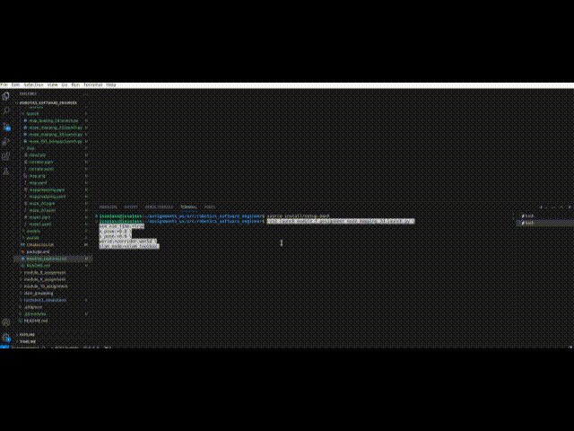
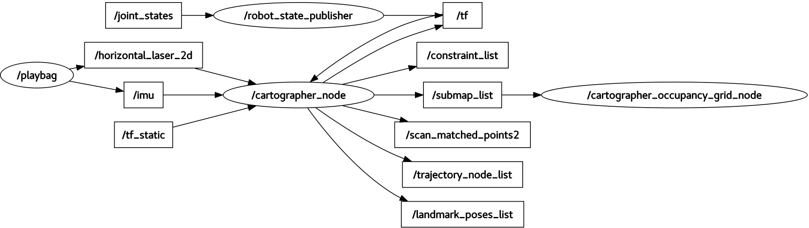
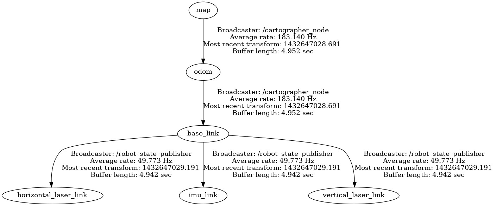
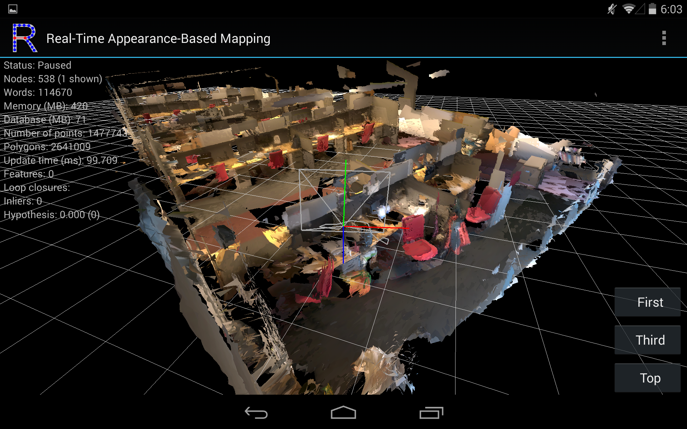
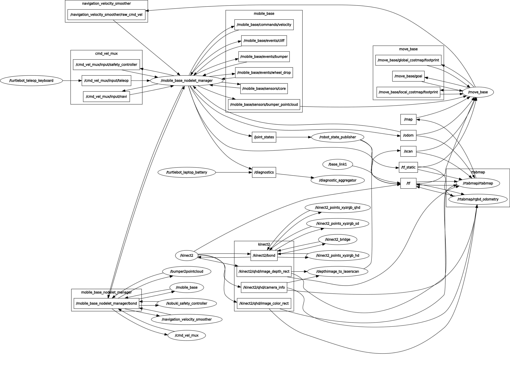
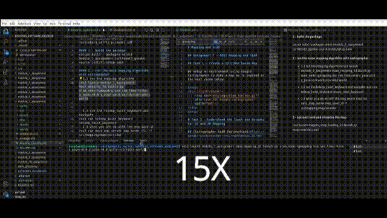
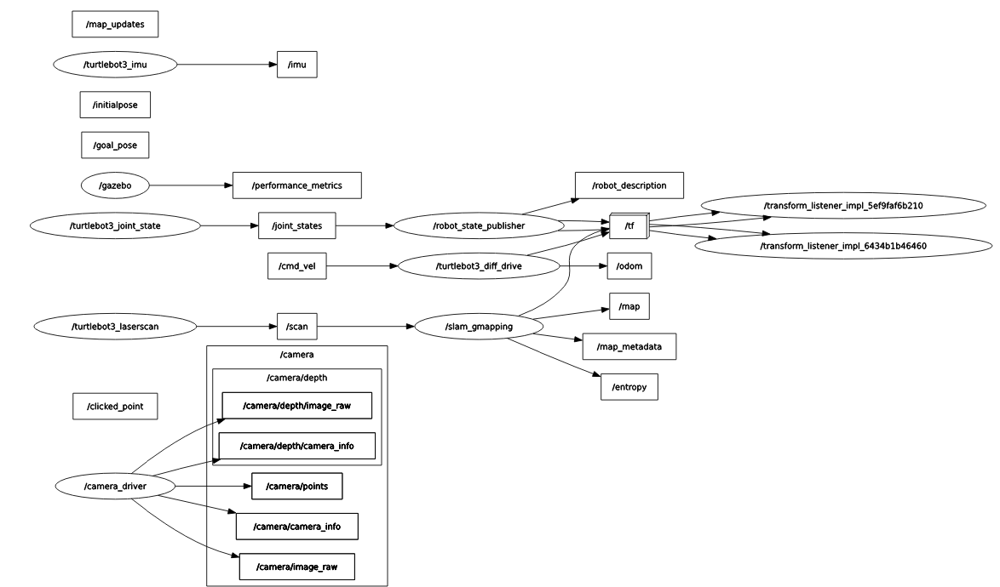

# Mapping and SLAM

## Assignment 7 - ROS2 Mapping and SLAM

We present the creation and results of different ROS 2 mapping algorithms in 2D and 3D.

The proposed algorithms are light weighted and could be launched on the robot to make maps for indoor and possible outdoor locations. 

We also developed a launch file for 3D mapping using RTAB-Map and explain the difficulties encountered using 2D or 3D simultaneous localization and mapping.


<details open>
<summary> <b>Brief Review<b></summary>

- We installed some packages like openslam_gmapping, slam_toolbox, rtabmap
- configured the packages
- Made with the model editor a low end complex map
- Finally written some lauch scripts in python (launch files) to easy manage the nodes
- Also a python file to transform .pgm to .png.
- Developed this documentation and videos.


### <b>Project Tree</b>

```sh
├── CMakeLists.txt
├── config
│   ├── mapper_params_online_async.yaml
│   └── rviz.rviz
├── doc
│   ├── imgs
│   │   ├── cartographer-map.png
│   │   ├── corridor.png
│   │   ├── gmapping.gif
│   │   ├── gmapping.PNG
│   │   ├── mapgmapping.png
│   │   ├── maze1.png
│   │   ├── maze_2d.png
│   │   ├── nodes_graph_demo_2d.jpg
│   │   ├── required-tf.jpg
│   │   ├── rtabmap-node.png
│   │   ├── rtabmap.png
│   │   ├── slam_toolbox.gif
│   │   └── slam_toolbox.PNG
│   └── utilities
│       └── pgm2png.py
├── launch
│   ├── map_loading_2d.launch.py
│   ├── maze_mapping_2d.launch.py
│   ├── maze_mapping_3d.launch.py
│   └── maze_tb3_bringup.launch.py
├── map
│   ├── cloud.ply
│   ├── corridor.pgm
│   ├── corridor.yaml
│   ├── mapgmapping.pgm
│   ├── mapgmapping.yaml
│   ├── map.png
│   ├── map.yaml
│   ├── maze1.pgm
│   ├── maze1.yaml
│   ├── maze_2d.pgm
│   └── maze_2d.yaml
├── models
│   ├── corridor
│   │   ├── model.config
│   │   └── model.sdf
│   ├── maze_map
│   │   ├── model.config
│   │   └── model.sdf
│   └── model.sdf
├── package.xml
├── README.md
└── worlds
    ├── corridor.world
    └── maze_map.world

```
</details>

## Task 1 - Create a 2D LIDAR based Map

We setup an environment using Google Cartographer to make a map as is exposed in the next video below.

&nbsp;
<div align="center">
    
</div>
&nbsp;

# Task 2 - Understand the Input and Outputs for 2D and 3D Mapping

## [Cartographer SLAM Explanation](https://google-cartographer-ros.readthedocs.io/en/latest/index.html)
---
&nbsp;
<div align="center">
    
</div>
&nbsp;

- Cartographer comes from the paper [***Real-Time Loop Closure in 2D LIDAR and SLAM***](https://static.googleusercontent.com/media/research.google.com/en//pubs/archive/45466.pdf).  

- Abstract:  It uses LIDAR with SLAM for acquiring efficient floor plans for devices of low computational resources. The paper ensures that you can map with loop close of 5cm of resolution using branch-and-bound apporach.

- Google Cartographer represents a real-time SLAM algorithm that builds maps and, simultaneously, tracks the position of a robot within those maps. It works by processing sensor data to create a consistent map of an environment, where most of the sensor data consists of laser scans, point clouds, IMU data, and odometry.

- First, it initiates with the operation of Cartographer itself, receiving data from sensors such as laser scans, which help the algorithm understand the surroundings of the robot. It makes use of loop closure to rectify errors in the map when it recognizes previously visited areas and does path correction on the same. It uses Pose Graph Optimization to minimize the accumulated error along the path of the robot and to build a more accurate map. This is achieved in optimization between the pose of a robot at different instants in time, ensuring the alignment of sensor data correctly.

- The cartographer splits the environment into so-called submaps, or smaller sub-pieces of a map. All these optimized submaps are, in turn, combined while the robot moves, with an incrementally complete map built. Such an algorithm keeps track of the robot's position within the map with its use, which can enable navigation. Outputs include a global map, some submaps, and trajectory data that help the robot to localize itself further and advance its plans for movement.

&nbsp;
<div align="center">

### Google Cartographer (ROS Node)



</div>
&nbsp;

<details>
  <summary><span style="color:lightblue">Subscribed Topics</span></summary>

Based on the documentation, you must provide at least one of these data topics.

- <span style="color:lightblue">**scan (sensor_msgs/LaserScan)**</span>
  - Comes from an axially rotating scanner (2D or 3D).
  - Will be used as inputs for SLAM if in the Lua configuration `num_laser_scans` is > 1 (scan_1 ... scan_n).
- <span style="color:lightblue">echoes (sensor_msgs/MultiEchoLaserScan)</span>
  - Comes from an axially rotating scanner (2D or 3D).
  - If `num_multi_echo_laser_scans` is set to 1 in the Lua config, this topic will be used as input for SLAM.
  - Only the first echo is used.
  - If `num_multi_echo_laser_scans` is greater > 1 (echoes_1, echoes_n) will be used as inputs for SLAM.
- <span style="color:lightblue">points2 (sensor_msgs/PointCloud2)</span>
  - `num_point_clouds = 1` in the Lua config, then this topic will be used as input for SLAM.
  - If `num_point_clouds` is greater > 1 (points1_1, pointsm_n..) will be used as inputs for SLAM.

You may also provide these inputs:
- <span style="color:lightblue">imu (sensor_msgs/Imu)</span>
  - 2D (optional) and 3D (required).
  - This topic will be used as input for SLAM.
- <span style="color:lightblue">odom (nav_msgs/Odometry)</span>
  - 2D (optional) and 3D (optional).
  - If `use_odometry` is enabled in the Lua config, this topic will be used as input for SLAM.
</details>

<details>
  <summary><span style="color:lightblue">Published Topics</span></summary>

- <span style="color:lightblue">**scan_matched_points2 (sensor_msgs/PointCloud2)**</span>
  - Point cloud used for scan-to-submap matching. This may be filtered and projected depending on the Lua configuration.
- <span style="color:lightblue">**submap_list (cartographer_ros_msgs/SubmapList)**</span>
  - List of all submaps, including pose and version number of each submap across all trajectories.
- <span style="color:lightblue">**tracked_pose (geometry_msgs/PoseStamped)**</span>
  - Published if the `publish_tracked_pose` parameter is true, indicating the tracked frame's pose relative to the map frame.
</details>

<details>
  <summary><span style="color:lightblue">Services</span></summary>

  - <span style="color:lightblue">**submap_query (cartographer_ros_msgs/SubmapQuery)**</span>
    - Fetches the requested submap.
  - <span style="color:lightblue">**start_trajectory (cartographer_ros_msgs/StartTrajectory)**</span>
    - Starts a trajectory using default sensor topics and configuration. Optionally, an initial pose can be specified.
  - <span style="color:lightblue">**trajectory_query (cartographer_ros_msgs/TrajectoryQuery)**</span>
    - Returns trajectory data from the pose graph.
  - <span style="color:lightblue">**finish_trajectory (cartographer_ros_msgs/FinishTrajectory)**</span>
    - Finishes the trajectory by running final optimization.
  - <span style="color:lightblue">**write_state (cartographer_ros_msgs/WriteState)**</span>
    - Writes the current state to a file, useful for generating assets like probability grids or PLY files.
  - <span style="color:lightblue">**get_trajectory_states (cartographer_ros_msgs/GetTrajectoryStates)**</span>
    - Returns the IDs and states of the trajectories for monitoring Cartographer's status.
  - <span style="color:lightblue">**read_metrics (cartographer_ros_msgs/ReadMetrics)**</span>
    - Returns runtime metrics of Cartographer.

</details>

<details>
  <summary><span style="color:lightblue">Required Tf Transforms</span></summary>

<div align="center">
    
</div>


- Transforms from all incoming sensor data frames to the `tracking_frame` and `published_frame` must be available, typically published by a `robot_state_publisher` or `static_transform_publisher`.
</details>

<details>
  <summary><span style="color:lightblue">Provided Tf Transforms</span></summary>

- Transformation between the `map_frame` and `published_frame` is provided, unless `publish_to_tf` is false.
- If `provide_odom_frame` is enabled, a continuous transform between `odom_frame` and `published_frame` is provided.
</details>

<details>
  <summary><span style="color:lightblue">Offline Node</span></summary>

  - Processes sensor data from provided bags and publishes the resulting Cartographer state.
  - Published Topics:
    - <span style="color:lightblue">**~bagfile_progress (cartographer_ros_msgs/BagfileProgress)**</span>
      - Publishes bag file processing progress, including detailed information about the current bag.

</details>


<details>
  <summary><span style="color:lightblue">Occupancy Grid Node</span></summary>

- Builds and publishes an occupancy grid from SLAM submaps.
- Published Topics:
  - <span style="color:lightblue">**map (nav_msgs/OccupancyGrid)**</span>
    - Continuously publishes the map, with updates depending on the map size.
</details>

<details>
  <summary><span style="color:lightblue">Pbstream Map Publisher Node</span></summary>

  - Creates a static occupancy grid from a serialized Cartographer state.
  - Published Topics:
    - <span style="color:lightblue">**map (nav_msgs/OccupancyGrid)**</span>
      - Latched occupancy grid topic.

</details>

&nbsp;

## RTAB Map SLAM Explanation
---
&nbsp;
<div align="center">
    
</div>
&nbsp;

- RTABMap comes from the paper [***Online Global Loop Closure Detection for Large-Scale Multi-Session
Graph-Based SLAM***](https://introlab.3it.usherbrooke.ca/images/e/eb/Labbe14-IROS.pdf).  

- It can use the same inputs or sensors as google cartographer but ads stereo and depth cameras to the input to make the loop close and forms a 3D reconstruction of the site.

- Abstract: Specially focused on long maps for SLAM, ideal for uncertainity and multi-session mapping addressing the global loop closure detection apporach.  The size of the environment is important and for this task is propossed a memory management approach.  This original paper uses a multi-session for a robot equiped with a Kinect and range finder.

- RTAB-Map is an open-source SLAM solution for large-scale 2D and 3D mapping, compatible with both ROS and ROS2. It supports RGB-D and stereo cameras, LiDAR, IMUs, and odometry sensors, making it versatile for a range of robotic applications. RTAB-Map's standout feature is its appearance-based loop closure detection, which reduces drift by recognizing previously visited locations and adjusting the robot’s trajectory to improve map accuracy.

- Using a pose graph for map optimization, RTAB-Map refines maps by minimizing errors along the robot's path. It creates real-time, high-quality 2D and 3D maps while managing memory efficiently to maintain performance. RTAB-Map also integrates backend optimization algorithms like GTSAM and g2o for enhanced accuracy.

- Popular in research and commercial robotics, RTAB-Map is ideal for indoor and outdoor navigation, autonomous vehicles, and augmented reality, though it performs best on systems with adequate computational resources.

&nbsp;

<div align="center">

### RTABMap (ROS Node)



</div>

&nbsp;

&nbsp;

For the explanation after this table, you must apply it for ROS2 to make it work.

&nbsp;

<div align="center">

| **Old Name**              |                   | **New Name**             |                   |
|---------------------------|-------------------|--------------------------|-------------------|
| rtabmap_ros                | rtabmap.launch     | [rtabmap_launch](#)       | rtabmap.launch     |
| rtabmap_ros                | rtabmap            | [rtabmap_slam](#)         | [rtabmap](#)       |
| rtabmap_ros                |                   | [rtabmap_odom](#)         |                   |
|                           | rgbd_odometry      |                          | [rgbd_odometry](#) |
|                           | stereo_odometry    |                          | [stereo_odometry](#)|
|                           | icp_odometry       |                          | [icp_odometry](#)  |
| rtabmap_ros                |                   | [rtabmap_sync](#)         |                   |
|                           | rgb_sync           |                          | [rgb_sync](#)      |
|                           | rgbd_sync          |                          | [rgbd_sync](#)     |
|                           | stereo_sync        |                          | [stereo_sync](#)   |
| rtabmap_ros                |                   | [rtabmap_util](#)         |                   |
|                           | point_cloud_xyz    |                          | [point_cloud_xyz](#)|
|                           | point_cloud_xyzrgb |                          | [point_cloud_xyzrgb](#)|
|                           | map_assembler      |                          | [map_assembler](#) |
|                           | map_optimizer      |                          | [map_optimizer](#) |
|                           | point_cloud_assembler |                        | [point_cloud_assembler](#)|
|                           | point_cloud_aggregator |                       | [point_cloud_aggregator](#)|
|                           | pointcloud_to_depthimage |                    | [pointcloud_to_depthimage](#)|
|                           | disparity_to_depth |                          | [disparity_to_depth](#)|
|                           | obstacles_detection|                          | [obstacles_detection](#)|
|                           | rgbd_relay         |                          | [rgbd_relay](#)    |
| rtabmap_ros                |                   | [rtabmap_legacy](#)       |                   |
|                           | data_odom_sync     |                          | [data_odom_sync](#)|
|                           | data_throttle      |                          | [data_throttle](#) |
|                           | stereo_throttle    |                          | [stereo_throttle](#)|

</div>

&nbsp;


<details>
  <summary><span style="color:lightblue">Node Overview: rtabmap</span></summary>

- **Map Building and Optimization**: Builds and optimizes a map graph based on loop closure detection. The database is stored at `~/.ros/rtabmap.db`.
- **ROS and RTAB-Map Parameters**: Customizable via ROS parameters for ROS integration and RTAB-Map library settings. Run `$ rtabmap --params` to list all parameters.
- **Launch Configuration**: Set parameters like `Optimizer/Iterations` or use arguments such as `--Grid/RangeMax 5` in launch files to control node behavior.
</details>

<details>
  <summary><span style="color:lightblue">Subscribed Topics</span></summary>

- **odom (nav_msgs/Odometry)**: Provides odometry data for pose tracking.
- **rgb/image (sensor_msgs/Image)**: RGB image input for mapping, required if depth is subscribed.
- **depth/image (sensor_msgs/Image)**: Depth image for 3D mapping when `subscribe_depth` is true.
- **scan (sensor_msgs/LaserScan)**: Laser scan input for mapping.
</details>

<details>
  <summary><span style="color:lightblue">Published Topics</span></summary>

- **grid_map (nav_msgs/OccupancyGrid)**: 2D occupancy grid of the mapped environment.
- **cloud_map (sensor_msgs/PointCloud2)**: 3D point cloud map of the environment.
- **global_path (nav_msgs/Path)**: Planned path to the specified goal.
</details>

<details>
  <summary><span style="color:lightblue">Services</span></summary>

- **get_map (nav_msgs/GetMap)**: Retrieves the 2D occupancy grid map.
- **publish_map (rtabmap_ros/PublishMap)**: Publishes map data.
- **set_goal (rtabmap_ros/SetGoal)**: Sets a topological goal in the map.
- **reset (std_srvs/Empty)**: Resets the map, starting a new session.
</details>

&nbsp;

<details>
  <summary><span style="color:lightblue">Node Overview: rtabmapviz</span></summary>

The `rtabmapviz` node provides a visualization interface for RTAB-Map, acting as a GUI for mapping data with specific options for RTAB-Map, similar to `rviz`.

**Arguments**:
- `-d "config.ini"`: Sets an RTAB-Map configuration file for GUI parameters (default is `/.ros/rtabmapGUI.ini`).
</details>

<details>
  <summary><span style="color:lightblue">Subscribed Topics</span></summary>

- **odom (nav_msgs/Odometry)**: Odometry data; required if `subscribe_depth` or `subscribe_stereo` is true and `odom_frame_id` is not set.
- **rgb/image (sensor_msgs/Image)**: RGB/Mono image, rectified when `subscribe_depth` is true.
- **depth/image (sensor_msgs/Image)**: Depth image, required if `subscribe_depth` is true.
- **scan (sensor_msgs/LaserScan)**: Laser scan; required if `subscribe_scan` is true.
- **scan_cloud (sensor_msgs/PointCloud2)**: Laser scan cloud; required if `subscribe_scan_cloud` is true.
- **left/image_rect (sensor_msgs/Image)** / **right/image_rect**: Left/Right images for stereo, required if `subscribe_stereo` is true.
- **rgbd_image (rtabmap_ros/RGBDImage)**: RGB-D image if `subscribe_rgbd` is true.
</details>

<details>
  <summary><span style="color:lightblue">Parameters</span></summary>

- `~subscribe_depth` (bool, default: "false"): Enables depth image subscription.
- `~subscribe_scan` (bool, default: "false"): Enables laser scan subscription.
- `~subscribe_stereo` (bool, default: "false"): Enables stereo images subscription.
- `~frame_id` (string, default: "base_link"): Frame attached to the mobile base.
- `~queue_size` (int, default: 10): Queue size for each synchronized topic.
</details>

<details>
  <summary><span style="color:lightblue">Required TF Transforms</span></summary>

- **base_link** → **<sensor frame>**: Periodic broadcast, typically by a `robot_state_publisher`.
- **odom** → **base_link**: Provided by the odometry system.
- **map** → **odom**: Represents current odometry correction.
</details>

<details>
  <summary><span style="color:lightblue">Published Topics</span></summary>

- **odom (nav_msgs/Odometry)**: Odometry stream. Sends null odometry if it cannot be computed.
- **odom_info (rtabmap_ros/OdomInfo)**: Odometry info stream. Includes feature information if `Odom/FillInfoData` is true.
- **odom_last_frame (sensor_msgs/PointCloud2)**: 3D features of the last frame used to estimate the transformation.
- **odom_local_map (sensor_msgs/PointCloud2)**: Local map of 3D features used to estimate the transformation. Published if `Odom/Strategy=0`.
</details>

<details>
  <summary><span style="color:lightblue">Services</span></summary>

- **reset_odom (std_srvs/Empty)**: Restarts odometry to identity transformation.
- **reset_odom_to_pose (rtabmap_ros/ResetPose)**: Restarts odometry to specified transformation.
- **pause_odom (std_srvs/Empty)**: Pauses odometry.
- **resume_odom (std_srvs/Empty)**: Resumes odometry.
</details>

&nbsp;

<details>
  <summary><span style="color:lightblue">Visual and Lidar Odometry</span></summary>

Common odometry methods for `rgbd_odometry`, `stereo_odometry`, and `icp_odometry` nodes, which provide odometry information for visual and lidar sensors. Null transformations are sent if odometry cannot be updated.

- **ROS Parameters**: Connection parameters for RTAB-Map.
- **RTAB-Map Parameters**: Library-specific parameters.
- **Arguments**: `--params` to show RTAB-Map parameters for the node.
</details>

<details>
  <summary><span style="color:lightblue">Published Topics</span></summary>

- **odom (nav_msgs/Odometry)**: Odometry stream.
- **odom_info (rtabmap_ros/OdomInfo)**: Odometry info stream.
- **odom_last_frame (sensor_msgs/PointCloud2)**: 3D features of the last frame.
- **odom_local_map (sensor_msgs/PointCloud2)**: Local map for transformation reference (if `Odom/Strategy=0`).
</details>

<details>
  <summary><span style="color:lightblue">Services</span></summary>

- **reset_odom**: Restarts odometry to identity transformation.
- **reset_odom_to_pose**: Restarts odometry to a specified pose.
- **pause_odom**: Pauses odometry.
- **resume_odom**: Resumes odometry.
</details>

<details>
  <summary><span style="color:lightblue">Parameters</span></summary>

- **~frame_id**: Frame attached to the mobile base (default: "base_link").
- **~odom_frame_id**: The odometry frame (default: "odom").
- **~publish_tf**: Whether to publish TF from `/odom` to `/base_link` (default: true).
- **~initial_pose**: Initial odometry pose (default: "").
- **~publish_null_when_lost**: Publish null transform if odometry is lost (default: true).
</details>

<details>
  <summary><span style="color:lightblue">Required and Provided TF Transforms</span></summary>

- **Required TF Transforms**: `base_link → <sensor_frame>`.
- **Provided TF Transforms**: `odom → base_link`.
</details>

&nbsp;

## Task 3 - Explaining the Mapping Algorithm (Gmapping)

&nbsp;

<div align="center">
    
</div>

&nbsp;

---
&nbsp;

- Gmapping is an algorithm used to make 2D maps of the environment from a robot's sensors, mainly LIDAR. It employs a particle filter for the robot to simultaneously estimate its position and build a map in an unknown environment. 

- A simple explanation of gmapping algorithm:
  - Particle Filters: Consider many small hypotheses (particles) scattered in the environment, each corresponding to one possible location of the robot. As the robot moves these particles get updated according to sensor data and some of the particles will be more likely than the others. It is sort of a guessing game at where it is and then takes those guesses and refines them as the robot gets more and more data.

  - Map Update: This is the update of the algorithm every time the robot performs LIDAR scanning. With each motion, it continuously builds up the map by adding a new scan to the previous data. Particles also contribute in refocusing the position of the robot to attain more accuracy as it starts to grow the map.

  - Handling Sensor Noise: LIDAR, among other sensors, is extremely noisy; hence, these build errors. Gmapping handles this by having the particles sample over a range of possibilities regarding what could be going on. It isn't just a guess but rather thousands of guesses combined to come up with something fairly reliable to constitute a map.

- **Relation to Practical Application - Creation of 2D LIDAR Map:
However, for Task 1, you generated a 2D map of the environment using LIDAR data. Here is where Gmapping will come into play. As you moved your robot and collected sensor data, Gmapping helped in generating a coherent map by:**

**Estimating the position of your robot with good accuracy using the particle filter.**
**Updating the map upon gathering new LIDAR scans as you moved.
This would allow sensor noise compensation to ensure small errors in the LIDAR readings did not affect the overall accuracy of the map made.
With the use of Gmapping, one could ensure that not only was the map made consistent with the movements that the robot had performed but also reliable in a noisy real-world environment.**


&nbsp;
<div align="center">

### Gmapping (ROS Node)



</div>
&nbsp;

&nbsp;

<details>
  <summary><span style="color:lightblue">Node Overview: slam_gmapping</span></summary>

&nbsp;


- **SLAM Algorithm**: Creates a map of the environment using laser scan data and odometry. The node subscribes to laser scan data and processes it to build the map over time.
- **Mapping and Localization**: Performs incremental mapping and localization. Outputs a grid map representation in the form of `nav_msgs/OccupancyGrid`.
- **Parameters**: Customizable via ROS parameters to adjust the behavior of the SLAM algorithm, such as scan matching and map resolution.
</details>

<details>
  <summary><span style="color:lightblue">Subscribed Topics</span></summary>

- **tf (tf/tfMessage)**: Transforms necessary to relate frames for laser, base, and odometry.
- **scan (sensor_msgs/LaserScan)**: Laser scans to create the map from.
</details>

<details>
  <summary><span style="color:lightblue">Published Topics</span></summary>

- **map_metadata (nav_msgs/MapMetaData)**: Provides metadata for the generated map.
- **map (nav_msgs/OccupancyGrid)**: Occupancy grid map created from laser scans.
- **~entropy (std_msgs/Float64)**: Provides the entropy estimation for the robot’s pose uncertainty.
</details>

<details>
  <summary><span style="color:lightblue">Services</span></summary>

- **dynamic_map (nav_msgs/GetMap)**: Service to request the current map from the node.
</details>

<details>
  <summary><span style="color:lightblue">Parameters</span></summary>

- **~inverted_laser (string, default: "false")**: Orientation of the laser.
- **~throttle_scans (int, default: 1)**: Process 1 out of every this many scans.
- **~base_frame (string, default: "base_link")**: The frame attached to the mobile base.
- **~map_frame (string, default: "map")**: The frame attached to the map.
- **~odom_frame (string, default: "odom")**: The frame attached to the odometry system.
- **~map_update_interval (float, default: 5.0)**: Time between updates to the map (in seconds).
- **~maxUrange (float, default: 80.0)**: Maximum usable range of the laser.
- **~sigma (float, default: 0.05)**: Sigma used by greedy endpoint matching.
- **~kernelSize (int, default: 1)**: Kernel size for correspondence matching.
- **~lstep (float, default: 0.05)**: Optimization step in translation.
- **~astep (float, default: 0.05)**: Optimization step in rotation.
- **~iterations (int, default: 5)**: Number of iterations for scan matching.
- **~lsigma (float, default: 0.075)**: Sigma of a beam used for likelihood computation.
- **~ogain (float, default: 3.0)**: Gain for smoothing resampling effects.
- **~lskip (int, default: 0)**: Number of beams to skip in each scan.
- **~minimumScore (float, default: 0.0)**: Minimum score for considering scan matching good.
- **~srr, ~srt, ~str, ~stt (float, default: 0.1-0.2)**: Odometry errors for translation and rotation.
- **~linearUpdate (float, default: 1.0)**: Distance before processing the scan again (in meters).
- **~angularUpdate (float, default: 0.5)**: Angle before processing the scan again (in radians).
- **~temporalUpdate (float, default: -1.0)**: Time-based update interval.
- **~resampleThreshold (float, default: 0.5)**: Neff-based resampling threshold.
- **~particles (int, default: 30)**: Number of particles in the filter.
- **~xmin, ~ymin, ~xmax, ~ymax (float, default: -100 to 100)**: Initial map size (in meters).
- **~delta (float, default: 0.05)**: Resolution of the map (in meters per occupancy grid block).
- **~llsamplerange, ~llsamplestep (float, default: 0.01)**: Translational sampling range and step for likelihood.
- **~lasamplerange, ~lasamplestep (float, default: 0.005)**: Angular sampling range and step for likelihood.
- **~transform_publish_period (float, default: 0.05)**: Time between transform publications.
- **~occ_thresh (float, default: 0.25)**: Threshold for occupancy values.
- **~maxRange (float)**: Maximum range of the sensor.
</details>

<details>
  <summary><span style="color:lightblue">Required tf Transforms</span></summary>

- **<the frame attached to incoming scans> → base_link**: Typically broadcast periodically by a `robot_state_publisher` or a `tf_static_transform_publisher`.
- **base_link → odom**: Typically provided by the odometry system.
</details>

<details>
  <summary><span style="color:lightblue">Provided tf Transforms</span></summary>

- **map → odom**: Current estimate of the robot's pose within the map frame.
</details>

&nbsp;


### Comparison Table of Google Cartographer and RTABMap
---

&nbsp;

<div align="center">

| **Feature**                  | **Google Cartographer**        | **RTAB-Map**                     | **Gmapping**                      |
|:-----------------------------:|:------------------------------:|:--------------------------------:|:---------------------------------:|
| **SLAM Type**                 | LiDAR-based (primarily)        | Vision and LiDAR-based           | LiDAR-based                       |
| **Supported Sensors**         | LiDAR, IMU, odometry           | Stereo cameras, RGB-D, LiDAR, odometry, IMU | LiDAR, odometry                   |
| **Mapping**                   | 2D and 3D                      | 2D and 3D                        | 2D                                |
| **Localization**              | Yes                            | Yes                              | Yes                               |
| **Loop Closure**              | Yes                            | Yes                              | No                                |
| **Map Optimization**          | Global pose graph optimization | Global pose graph optimization   | Particle filter-based             |
| **Trajectory Handling**       | Multi-trajectory support       | Single trajectory                | Single trajectory                 |
| **Real-Time Performance**     | High (efficient for LiDAR)     | Moderate (depends on sensor type and data) | High (efficient for LiDAR)        |
| **Best Environments**         | Indoor, structured spaces      | Indoor/outdoor, unstructured environments | Indoor, structured environments  |
| **ROS2 Support**              | Yes (ROS2 packages available)  | Yes (ROS2 packages available)    | Yes (ROS2 packages available)     |
| **Documentation**             | Comprehensive                  | Comprehensive                    | Moderate                          |
| **Configuration Complexity**  | Moderate to High               | Moderate                         | Moderate                          |

</div>

&nbsp;

### 2D vs 3D SLAM Comparsion
---

&nbsp;

<div align="center">

| Aspect                       | 2D Mapping                                      | 3D Mapping                                         |
|------------------------------|-------------------------------------------------|----------------------------------------------------|
| **Complexity**                | Lower complexity: typically requires fewer sensors and computational resources. Easier to set up and configure. | Higher complexity: requires more advanced hardware (e.g., RGB-D, LiDAR) and higher computational resources. Configurations can be intricate. |
| **Accuracy**                  | Suitable for environments with predominantly horizontal features (e.g., rooms, hallways). Limited in representing elevation changes and 3D structures accurately. | Capable of capturing vertical structures, elevation, and 3D spatial details, offering higher accuracy in complex environments. |
| **Best-Suited Environments**  | Ideal for flat or structured indoor environments, such as offices or warehouses where only planar information is needed. | Suitable for dynamic, unstructured, or mixed environments, including both indoor and outdoor spaces. Ideal for environments requiring obstacle height and spatial depth understanding. |
| **Sensor Requirements**       | Can be used with simpler sensors like 2D LiDAR or single cameras. | Requires advanced sensors such as RGB-D cameras, 3D LiDAR, or depth sensors to capture full 3D data. |
| **Processing Power**          | Requires less computational power, making it more suitable for resource-limited devices. | Needs more powerful computing resources due to the processing of larger datasets and more complex algorithms. |
| **Real-Time Performance**     | High performance with low latency, ideal for real-time applications in structured environments. | Moderate to low performance due to the higher computational demands, though it can be optimized for real-time applications in dynamic environments. |
| **Data Representation**      | Data is represented as a 2D grid or map, with simple features like walls and obstacles. | Data is represented in 3D, with detailed information about the environment, including vertical surfaces and depth information. |
| **Cost**                      | Generally lower cost due to simpler sensors and lower hardware requirements. | Higher cost due to the need for advanced 3D sensors and processing hardware. |
| **Applications**              | Commonly used in indoor navigation, mobile robots, and autonomous vehicles operating in structured environments. | Used in applications requiring detailed environment modeling, such as autonomous vehicles in complex urban environments, robotics in unstructured areas, and VR/AR mapping. |

</div>


<details open>
<summary> <b>Using The Package <b></summary>

- A note before proceed:
  - Watch that in .pgm files origin must be float, not integers. Otherwise you could have an error like: 
  - [ERROR] [ros2-4]: process has died [pid 18959, exit code 1, cmd 'ros2 lifecycle set /map_server activate'].


- Next, follow the next steps to replicate the outcome...

- Install eigen, ros2 controllers and other libraries using your ros distribution if you dont have it installed
```sh
    sudo apt-get update
    sudo apt-get install 
    sudo apt-get install ros-<ros-distro>-slam-toolbox
```

- Create the workspace
```sh
    cd ~
    mkdir -p assignments_ws/src
    cd assignments_ws/src
```
- Fork (or clone) this repo in the `~/assignments_ws/src` folder by typing:
```sh 
    git clone https://github.com/Robotisim/robotics_software_engineer.git
    git clone https://github.com/Project-MANAS/slam_gmapping.git -b eloquent-devel
    git clone https://github.com/robotis-git/turtlebot3_simulations.git -b humble-devel
```

- From `module_7_assignment/models/model.sdf`, copy the content and replace the model.sdf located in `turtlebot3_simulations/turtlebot3_gazebo/models/turtlebot3_waffle_pi/model.sdf`.

- Later compile the module_7_assignmet repository and source it
```sh
    cd ~/assignments_ws
    colcon build --packages-select openslam_gmapping slam_gmapping
    colcon build --packages-select module_7_assignment turtlebot3_gazebo
    source install/setup.bash
```

- Run the demos for Assignment 7:
- On terminal 1 (for slam_toolbox)
```sh
    ros2 launch module_7_assignment maze_mapping_2d.launch.py slam_node:=slam_toolbox 
    use_sim_time:=true x_pose:=0.0 y_pose:=0.0 world:=corridor.world
```
- On terminal 1 (for gmapping)
```sh
    ros2 launch module_7_assignment maze_mapping_2d.launch.py slam_node:=gmapping
    use_sim_time:=true x_pose:=0.0 y_pose:=0.0 world:=corridor.world
```
- On terminal 1 (for rtab-map)
```sh
    ros2 launch module_7_assignment maze_mapping_3d.launch.py
```


- On terminal 2
```sh
    ros2 run teleop_twist_keyboard teleop_twist_keyboard
```

- Navigate with the keys to construct the map (see rviz how is going)

- When you are satisfied with the contruscted map input the following commands on a new terminal to save the map.
```sh
    ros2 run nav2_map_server map_saver_cli -f 
    module_7_assignment/mapping/map/corridor
```

- On terminal 3, optionally load and visualize the map
```sh
    ros2 launch mapping map_loading_2d.launch.py map:=corridor.yaml
```

</details>

<details open>
<summary> <b>Results <b></summary>

#### RTAB-Map

- Future video

#### Google Cartographer

- Future video

#### Gmapping

- Future video


</details>


<details open>
<summary> <b>Issues<b></summary>

- No issues found today

</details>

<details open>
<summary> <b>Future Work<b></summary>

- Make videos for youtube.

</details>

<details open>
<summary> <b>Contributing<b></summary>

Your contributions are always welcome! Please feel free to fork and modify the content but remember to finally do a pull request.

</details>

<details open>
<summary> :iphone: <b>Having Problems?<b></summary>

<p align = "center">

[](https://www.linkedin.com/in/riawa)
[](https://t.me/issaiass)
[](https://www.instagram.com/daqsyspty/)
[](https://twitter.com/daqsyspty) 
[](https://www.facebook.com/daqsyspty)
[](https://www.linkedin.com/in/riawe)
[](https://www.linkedin.com/in/riawe)
[](https://wa.me/50766168542?text=Hello%20Rangel)
[](mailto:issaiass@hotmail.com)
[](mailto:riawalles@gmail.com)

</p

</details>

<details open>
<summary> <b>License<b></summary>
<p align = "center">

</p>
</details>